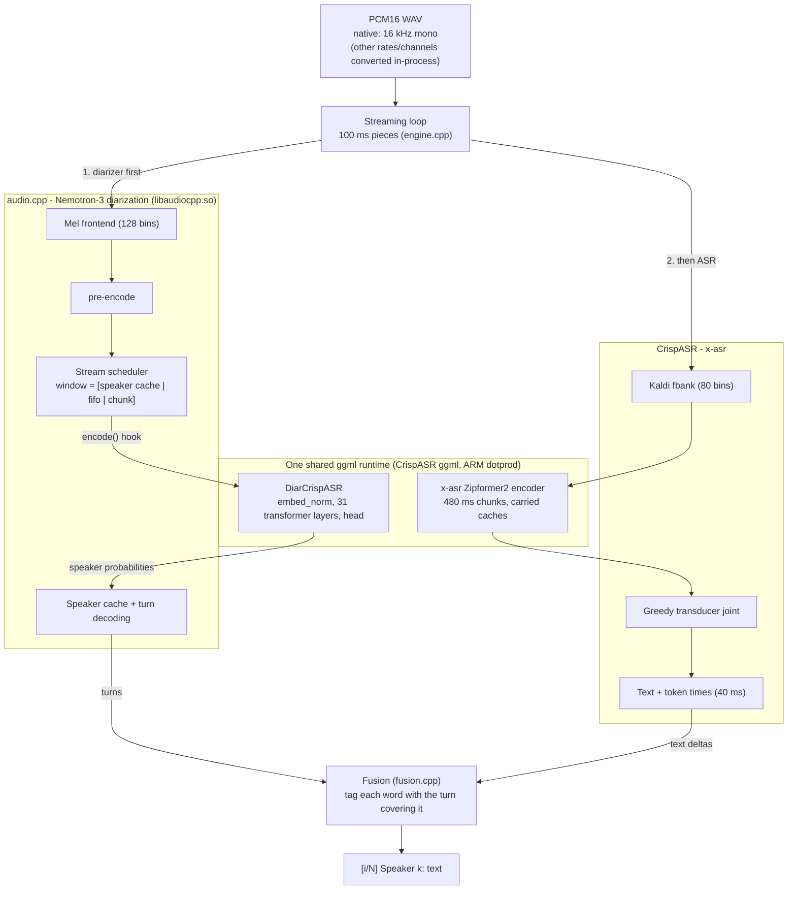

# nemo-x-asr-diarizer.cpp

Streaming speech recognition **and** speaker diarization in one process, on one audio timeline, on a phone CPU.

- **Words:** [X-ASR](https://huggingface.co/cstr/x-asr-zh-en-GGUF), a streaming Zipformer2 transducer (zh + en).
- **Speakers:** Nemotron-3 Diarization (streaming Sortformer, up to 8 speakers).
- **Fusion:** a small attribution layer that tags each word with who said it.

C++17 + ggml, CPU only, no Python at runtime. It replaces a 1.5B ASR+diarize LLM at 2.6x lower RTF and
5.5x less memory on the same phone.

## Architecture



Both models' heavy compute runs on one ggml runtime. The diarizer's encoder and head were ported from
audio.cpp into `src/diar_crispasr.cpp`. The port is bit-exact with audio.cpp's own path and ~1% faster
([docs/one-runtime-merge.md](docs/one-runtime-merge.md) §25-27). audio.cpp keeps the parts that are logic, not
compute: mel, pre-encode (0.05% of time), windowing, speaker cache and turn decoding.

## Models

| role | GGUF used (q8_0) | original weights | license |
|---|---|---|---|
| ASR | [cstr/x-asr-zh-en-GGUF](https://huggingface.co/cstr/x-asr-zh-en-GGUF) `x-asr-zh-en-q8_0.gguf` (168 MB) | [GilgameshWind/X-ASR-zh-en](https://huggingface.co/GilgameshWind/X-ASR-zh-en) | Apache-2.0 |
| diarization | [audio-cpp/Nemotron-3-Diarization-GGUF](https://huggingface.co/audio-cpp/Nemotron-3-Diarization-GGUF) `nemotron-3-diarization-q8_0.gguf` (107 MB) | [nvidia/Nemotron-3-Diarization](https://huggingface.co/nvidia/Nemotron-3-Diarization) | see model card |

`scripts/fetch_models.sh` downloads both and verifies them at value level.

## Input

Both models consume **16 kHz mono**, so that is the pipeline's native input: a 16 kHz mono 16-bit PCM WAV
goes straight in with no conversion. Other rates and channel counts are also accepted and converted
in-process (channel mixdown, then Lanczos3 resampling to 16 kHz). Unlike the VibeASR baseline, which runs at
24 kHz, nothing needs converting ahead of time. The only supported encoding is PCM16 WAV.

## Output

Matches the sibling ASR archive's streaming convention, so its WER and speaker-attribution scorers run on it
directly:

```
[1/12]
 Speaker 0:一次次存取不同的视角
[2/12]
 Speaker 1:。黄灯的十字路口
```

## Results

Phone: Oppo CPH2371 (Dimensity 1300), `taskset C0` (the two A78 prime cores), `--threads 2`.
Models: see [Models](#models).

| | RTF | peak RSS | first text |
|---|---|---|---|
| 1.5B ASR+diarize baseline (armed) | 1.2231 | 2198 MB | 2.93 s |
| this composite (armed) | 0.4627 | 396 MB | 0.32 s |
| this composite, current build* | **0.415** | **393 MB** | 0.40 s |

\* `gate_ms_v2` (45 s, bilingual, 4 speakers). The current build adds ARM dotprod and the unified runtime. It
was measured back-to-back in a working session, not under the armed/witnessed protocol of the first two rows.
Its output is byte-identical to the armed build.

### Accuracy vs VibeASR streaming 1.5B

**Transcription** (WER, lower is better). The diarizer never changes the text: the transcript is
byte-identical with or without it.

| test set | VibeASR 1.5B | this composite | reading |
|---|---|---|---|
| LibriSpeech, 40 utterances (clean English) | 4.51 % | 4.27 % | tie (paired McNemar p = 1.0) |
| `gate_ms_v2` (bilingual, 4 speakers) | 17.65 % | 17.65 % | same |
| `holdout_en` (hard English) | 26.36 % | 24.55 % | composite slightly better |
| `holdout_zh` (hard Chinese) | 15.38 % | 7.91 % | composite ~2x fewer errors |

The last three are single clips: observations, not statistical proof.

**Who spoke** (`gate_ms_v2`, share of the reference words):

| | VibeASR 1.5B | this composite |
|---|---|---|
| right speaker | ~58 % | ~84 % |
| wrong speaker | ~42 % | ~7 % |
| word not transcribed (so nothing to tag) | 0 % | ~9 % |

The composite tags **every word it transcribes**. The ~9% are ASR deletions: words the transcript is missing,
already counted in the WER above, which is the same for both systems on this clip. Among the words both
systems produce, the composite puts the wrong speaker on ~8% versus ~42% for VibeASR. Details in
[docs/findings.md](docs/findings.md).

## Build and run

Needs the pinned upstreams in `deps.lock`. Published on the `nemo-x-asr-diarizer` branch of
[audio.cpp](https://github.com/vieenrose/audio.cpp), [CrispASR](https://github.com/vieenrose/CrispASR) and
[ggml](https://github.com/vieenrose/ggml).

```bash
scripts/fetch_models.sh        # two GGUFs, verified
scripts/build_host.sh          # -> build/nemo-x-asr-diarizer
./build/nemo-x-asr-diarizer --audio clip.wav --windows
./build/nemo-x-asr-diarizer --audio clip.wav --json --turns-out turns.json --live
```

Android (arm64-v8a, NDK r26): `scripts/build_android.sh`. On device, set `--threads` to the number of cores
in the mask:

```bash
adb shell "cd /data/local/tmp/nemo && LD_LIBRARY_PATH=. taskset C0 ./nemo-x-asr-diarizer --audio clip.wav -t 2"
```

Useful flags:

| flag | effect |
|---|---|
| `--windows` | `[k/N]` blocks every 2.93 s (drop-in for the VibeASR harness) |
| `--live` | print provisional segments as they close |
| `--no-diar-native` | run the diarizer encoder on audio.cpp's own ggml (old path) |
| `--diar-threshold`, `--diar-opt K=V` | diarizer decode config (defaults: threshold 0.3, pad 45 frames) |
| `XASR_JOINT_Q8=1` | ~5-7% faster ASR leg; WER moves on some clips, so off by default |

## Known limits

- **Turns commit late.** The diarizer streams, but its first turns arrive ~30 s into a clip. Until then,
  `--live` output is provisional.
- **Diarization recall.** It misses ~41% of speech frames on the hard bilingual clip, with near-zero false
  alarms. This is the limiting factor for attribution.
- **Two ggml libraries are still linked.** The CrispASR ggml fork cannot replace audio.cpp's (missing ops),
  so the unified runtime goes through audio.cpp's external-encoder hook instead.

## Docs

- [docs/findings.md](docs/findings.md): attribution, token timestamps, window format, diarizer knobs,
  phone findings, resampling
- [docs/one-runtime-merge.md](docs/one-runtime-merge.md): how the diarizer was moved onto the shared
  runtime, including the dead ends
- [docs/pipeline-design.md](docs/pipeline-design.md): performance work (dotprod, joint, KleidiAI, …)

## Provenance

[CrispASR](https://github.com/CrispStrobe/CrispASR) (MIT) for the x-asr runtime,
[audio.cpp](https://github.com/0xShug0/audio.cpp) (Apache-2.0) for Nemotron-3 diarization,
[ggml](https://github.com/ggml-org/ggml) (MIT) under both. See [PROVENANCE.md](PROVENANCE.md) for the
per-file list. Model weights carry their own licenses (`fetch_models.sh` prints them). This repository's
license covers the code here only.
