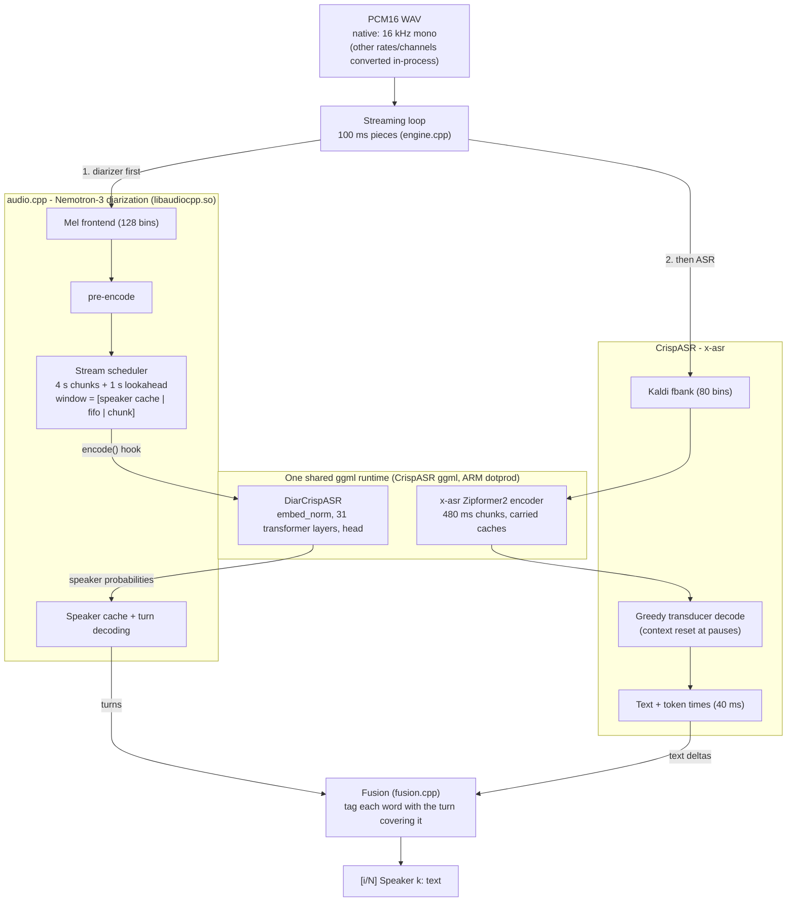

# nemo-x-asr-diarizer.cpp

Streaming speech recognition **and** speaker diarization in one process, on one audio timeline, on a phone CPU.

- **Words:** [X-ASR](https://huggingface.co/cstr/x-asr-zh-en-GGUF), a streaming Zipformer2 transducer (zh + en).
- **Speakers:** Nemotron-3 Diarization (streaming Sortformer, up to 8 speakers).
- **Fusion:** a small attribution layer that tags each word with who said it.

C++17 + ggml, CPU only, no Python at runtime. On the same phone it replaces a 1.5B ASR+diarize LLM at ~2x
lower RTF and ~5x less memory, with lower WER and far better speaker attribution; see [Results](#results).

**Latency:** words appear ~0.4 s after they are spoken; speaker labels are confirmed ~5 s behind the audio
(configurable, see [Known limits](#known-limits)).

## Architecture



Both models' heavy compute runs on one ggml runtime. The diarizer's encoder and head were ported from
audio.cpp into `src/diar_crispasr.cpp`. The port is bit-exact with audio.cpp's own path and ~1% faster
([docs/one-runtime-merge.md](docs/one-runtime-merge.md) §25-27). audio.cpp keeps the parts that are logic, not
compute: mel, pre-encode (0.05% of time), windowing, speaker cache and turn decoding.

## Models

| role | GGUF used (q8_0) | original weights | license |
|---|---|---|---|
| ASR | [cstr/x-asr-zh-en-GGUF](https://huggingface.co/cstr/x-asr-zh-en-GGUF) `x-asr-zh-en-q8_0.gguf` (168 MB) | [GilgameshWind/X-ASR-zh-en](https://huggingface.co/GilgameshWind/X-ASR-zh-en) | Apache-2.0 |
| diarization | [audio-cpp/Nemotron-3-Diarization-GGUF](https://huggingface.co/audio-cpp/Nemotron-3-Diarization-GGUF) `nemotron-3-diarization-q8_0.gguf` (107 MB) | [nvidia/Nemotron-3-Diarization](https://huggingface.co/nvidia/Nemotron-3-Diarization) | see model card |

`scripts/fetch_models.sh` downloads both and verifies them at value level.

## Input

Both models consume **16 kHz mono**, so that is the pipeline's native input: a 16 kHz mono 16-bit PCM WAV
goes straight in with no conversion. Other rates and channel counts are also accepted and converted
in-process (channel mixdown, then Lanczos3 resampling to 16 kHz). Unlike the VibeASR baseline, which runs at
24 kHz, nothing needs converting ahead of time. The only supported encoding is PCM16 WAV.

## Output

Matches the sibling ASR archive's streaming convention, so its WER and speaker-attribution scorers run on it
directly:

```
[1/12]
 Speaker 0:一次次存取不同的视角
[2/12]
 Speaker 1:。黄灯的十字路口
```

## Results

Phone: Oppo CPH2371 (Dimensity 1300), `taskset C0` (the two A78 prime cores), `--threads 2`.
Models: see [Models](#models).

| | RTF | peak RSS | first text |
|---|---|---|---|
| 1.5B ASR+diarize baseline (armed) | 1.2231 | 2198 MB | 2.93 s |
| this composite (armed) | 0.4627 | 396 MB | 0.32 s |
| this composite, current build* | **0.60** | **375 MB** | 0.40 s (speaker turns: 5.0 s) |

\* `gate_ms_v2` (45 s, bilingual, 4 speakers). The current build adds ARM dotprod, the unified runtime and
4 s diarizer chunks (turns commit at 5 s instead of 30.5 s, which costs RTF 0.42 -> 0.60), and an ASR decoder
reset at pauses (fewer dropped words). It was measured back-to-back in a working session, not under the
armed/witnessed protocol of the first two rows.

### Accuracy vs the on-edge baseline and the accuracy reference

- **VibeASR streaming 1.5B:** the on-edge baseline, run on the same phone with its official measurement
  config (int8 VAE, q8-head LM, `taskset C0`, 2 threads).
- **VibeASR streaming 7B (q4_k):** the transcription accuracy reference only, not a deployment target. It
  ran on the host (16 threads).
- **This composite:** run on the phone, current build.

Same 12 clips and scorer for all three (`score_stream.py`). `[Noise]`-style event tags are stripped from the
7B output. `gate_long` is 5.6 min, 6 voices, 44 zh/en switches (`tools/build_gate_long.py`).

**Transcription (WER, lower is better)**

| clip | 1.5B | 7B (reference) | composite |
|---|---|---|---|
| gate_ms | 0.144 | **0.082** | 0.155 |
| gate_ms_g100 | 0.227 | **0.113** | 0.165 |
| gate_ms_g1000 | 0.196 | **0.082** | 0.144 |
| gate_ms_v2 | 0.176 | **0.165** | 0.176 |
| gate_long | 0.210 | **0.134** | 0.162 |
| control_ls (en) | 0.055 | 0.053 | **0.044** |
| holdout_en | 0.264 | **0.236** | 0.259 |
| holdout_en_aligned | 0.250 | **0.227** | 0.255 |
| holdout_zh | 0.154 | **0.085** | **0.085** |
| holdout_zh2 | 0.120 | 0.089 | **0.047** |
| holdout_zh_aligned | 0.169 | 0.100 | **0.079** |
| holdout_zh_ph35200 | 0.165 | **0.083** | **0.083** |
| **all 12 (micro)** | 0.167 | **0.112** | 0.117 |

**Who spoke** (multi-speaker clips; share of reference words with the right / wrong speaker; the rest were not
transcribed; the reference here is the ground-truth manifest):

| clip | 1.5B | 7B | composite |
|---|---|---|---|
| gate_ms | 43 / 57 % | 43 / 57 % | **96 / 0 %** |
| gate_ms_g100 | 43 / 57 % | 43 / 57 % | **96 / 0 %** |
| gate_ms_g1000 | 38 / 61 % | 72 / 28 % | **100 / 0 %** |
| gate_ms_v2 | 58 / 42 % | **95 / 0 %** | 84 / 6 % |
| gate_long | 35 / 54 % | 39 / 59 % | **86 / 3 %** |
| **mean** | 44 / 54 % | 59 / 40 % | **92 / 2 %** |

Both VibeASR sizes mostly collapse the speakers into one or two labels (1-2 of 4-6 voices used, all clips but
`gate_ms_v2`). So the 7B is a transcription reference, not a speaker reference.

Versus the 7B reference, the composite:
- **Transcription:** 0.117 vs 0.112 micro WER (+0.005). It is better on Chinese, worse on English and on
  mixed-language clips.
- **Who spoke:** separates the speakers that both VibeASR models merge.
- **Resources:** runs on the phone at RTF 0.60 in ~430 MB, with speaker turns ~5 s behind the audio.

## Build and run

Needs the pinned upstreams in `deps.lock`. Published on the `nemo-x-asr-diarizer` branch of
[audio.cpp](https://github.com/vieenrose/audio.cpp), [CrispASR](https://github.com/vieenrose/CrispASR) and
[ggml](https://github.com/vieenrose/ggml).

```bash
scripts/fetch_models.sh        # two GGUFs, verified
scripts/build_host.sh          # -> build/nemo-x-asr-diarizer
./build/nemo-x-asr-diarizer --audio clip.wav --windows
./build/nemo-x-asr-diarizer --audio clip.wav --json --turns-out turns.json --live
```

Android (arm64-v8a, NDK r26): `scripts/build_android.sh`. On device, set `--threads` to the number of cores
in the mask:

```bash
adb shell "cd /data/local/tmp/nemo && LD_LIBRARY_PATH=. taskset C0 ./nemo-x-asr-diarizer --audio clip.wav -t 2"
```

Useful flags:

| flag | effect |
|---|---|
| `--windows` | `[k/N]` blocks every 2.93 s (drop-in for the VibeASR harness) |
| `--live` | print provisional segments as they close |
| `--no-diar-native` | run the diarizer encoder on audio.cpp's own ggml (old path) |
| `--diar-threshold`, `--diar-opt K=V` | diarizer decode config (defaults: threshold 0.3, pad 45 frames) |
| `--diar-session-opt K=V` | diarizer streaming geometry, e.g. `nemotron_3_diar.chunk_len=25` (latency vs RTF) |
| `XASR_RESET_BLANK_FRAMES=N` | ASR decoder-context reset after N silent 40 ms frames (default 25; 0 = off) |
| `XASR_JOINT_Q8=1` | ~5-7% faster ASR leg; WER moves on some clips, so off by default |

## Known limits

- **Speaker turns lag the words by ~5 s.** Text appears within ~0.4 s. Each speaker turn is confirmed once
  its 4 s diarizer chunk plus 1 s of lookahead is in, and `--live` labels before that are provisional. The
  latency is a setting: `--diar-session-opt nemotron_3_diar.chunk_len=25 ...chunk_right_context=4` gives
  ~2.4 s at RTF ~0.87, and `chunk_len=340 ...chunk_right_context=40 ...spkcache_update_period=300` gives
  30.5 s at RTF 0.42. The official `low` profile (~1 s) is not real time on 2 cores (RTF 3.4).
- **Diarization recall.** It misses 19% of speech frames on the 57 s bilingual clip and 7% on `gate_long`,
  with few false alarms (DER-lite 22.7% and 10.0%).
- **Some words are not transcribed.** These are overlapped speech (a single-stream ASR transcribes one voice
  at a time) and Chinese that follows English after a short pause. The latter comes from the x-asr model's
  own streaming state and would need retraining to fix
  ([docs/findings.md](docs/findings.md#missing-words-were-a-streaming-state-problem-not-diarization-2026-09-27)).
- **Two ggml libraries are still linked.** The CrispASR ggml fork cannot replace audio.cpp's (missing ops),
  so the unified runtime goes through audio.cpp's external-encoder hook instead.

## Docs

- [docs/findings.md](docs/findings.md): attribution, token timestamps, window format, diarizer knobs,
  phone findings, resampling, missing words
- [docs/one-runtime-merge.md](docs/one-runtime-merge.md): how the diarizer was moved onto the shared
  runtime, including the dead ends
- [docs/pipeline-design.md](docs/pipeline-design.md): performance work (dotprod, joint, KleidiAI, …)

## Provenance

[CrispASR](https://github.com/CrispStrobe/CrispASR) (MIT) for the x-asr runtime,
[audio.cpp](https://github.com/0xShug0/audio.cpp) (Apache-2.0) for Nemotron-3 diarization,
[ggml](https://github.com/ggml-org/ggml) (MIT) under both. See [PROVENANCE.md](PROVENANCE.md) for the
per-file list. Model weights carry their own licenses (`fetch_models.sh` prints them). This repository's
license covers the code here only.
